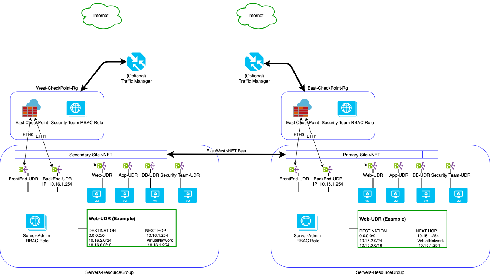

# Local Cloud ARM Templates

ARM Template Developed specifically for Local Cloud Migration.

Diagram used for ARM Template design



## Prequisite

Prior to running the ARM Template Resource Group must already be created. 

## Check Point CloudGuard 

ARM Template for Checkpoint was obtained from official CheckPoint github link:
- https://github.com/CheckPointSW/CloudGuardIaaS

## Deploy ARM Templates

Azure CLI
```
az deployment group create \
  --name ExampleDeployment \
  --resource-group ExampleGroup \
  --template-file storage.json \
  --parameters storageAccountType=Standard_GRS

````

PowerShell

```
New-AzResourceGroupDeployment -Name ExampleDeployment -ResourceGroupName ExampleResourceGroup `
  -TemplateFile c:\MyTemplates\azuredeploy.json `
  -TemplateParameterFile c:\MyTemplates\storage.parameters.json
```